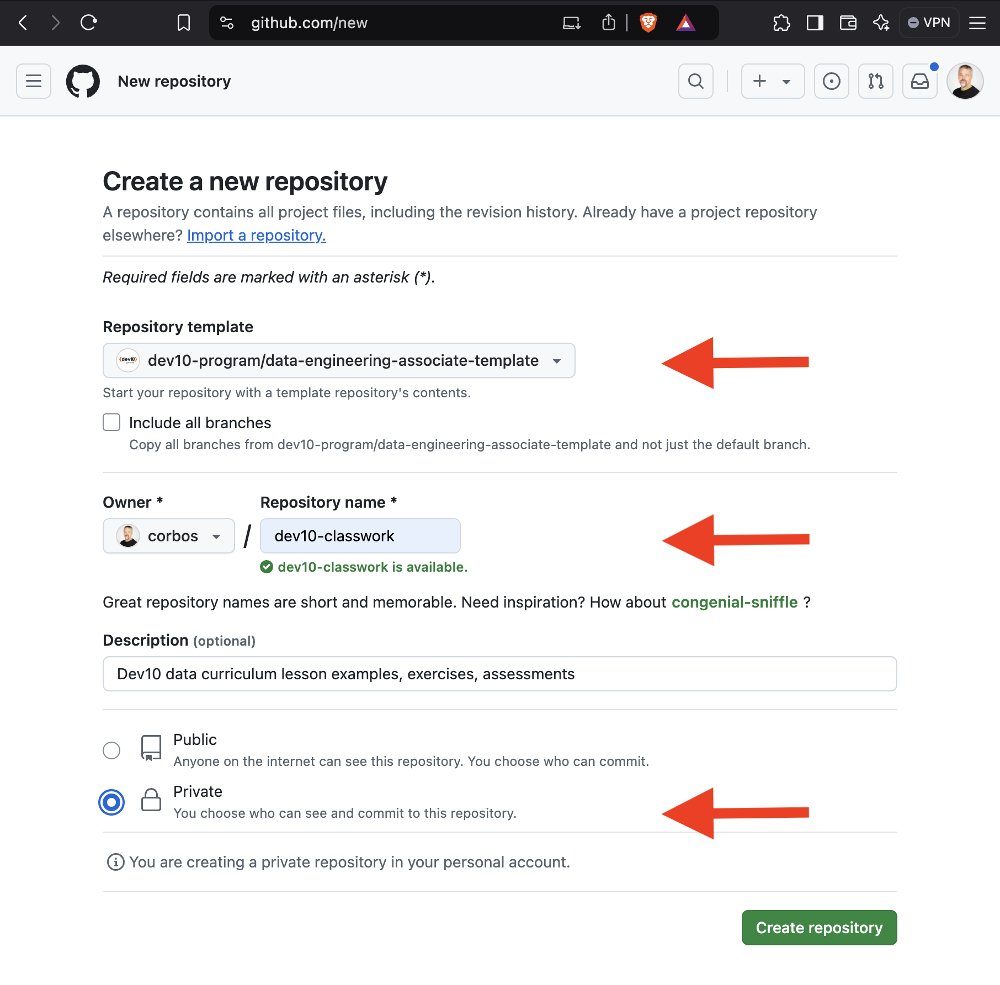
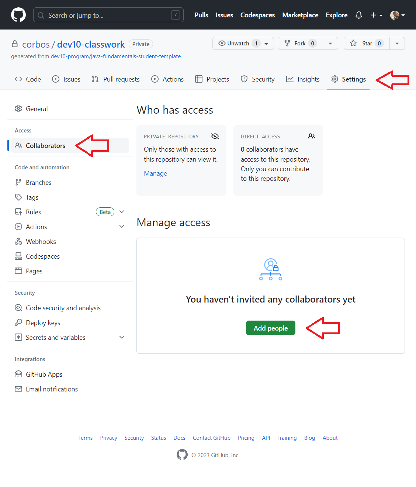

# Activity: Create a Dev10 Classwork Repository

## Introduction

We're about to give you a ton of existing code and documentation. The code includes exercises, starter code for assessments, and sample projects connected to lessons. Documentation includes test plans and design documents.

One option is to embed that content in the learning management system. Download it. That's not a great option. Downloading individual projects and files creates a maintenance nightmare. They're hard to organize. What's worse: as instructors we can't see exercise results. Exercises are never graded, but we want to see how you're all doing.

A better option is Git. A remote Git repository can be deliberately organized (we organized it), and we can `git push` our code to a remote. In this case, we generate our remote repository from a **template**. A GitHub template repository is a bunch of starter code used to create a remote repository in your GitHub account.

The Dev10 classwork repository is required. We use it to practice, practice, practice.

### Goals

- Create a Dev10 classwork repository under in your GitHub account generated from a template.

## Create a classwork repository

1. Visit https://github.com/new to create a new repository.
2. Under the "Repository template" label, select the `dev10-program/data-engineering-associate-template` repository template.
3. Select _your GitHub username_ in the "Owner" select list.
4. Name your repository `dev10-classwork`.
5. Toggle the radio button to "Private".
6. Clicking the "Create repository" button will create a `dev10-classwork` repository in your GitHub account.



> For more information about creating a repository from a template, see https://docs.github.com/en/repositories/creating-and-managing-repositories/creating-a-repository-from-a-template.

### Adding Instructors as collaborators

After creating your repository, complete the following steps to add your instructors as collaborators.

1. Visit the home page for your `dev10-classwork` GitHub repository.
2. Browse to the "Settings" tab.
3. On the left, click on "Manage access".
4. Click on the "Invite a collaborator" button.
5. In the popup window, type your instructor's GitHub username.
6. Click the "Add {username} to this repository" button to complete the process.
7. Repeat steps #4-6 to add additional instructors as collaborators.



## Cloning Your Repo

Before you begin working on your classwork, you need to clone your GitHub repository to your local machine.

1. Open a terminal window.
2. Navigate to your dedicated repository directory using the `cd` command.
3. Use the `git clone` command to clone your repository to your local machine.

    ```
    git clone https://github.com/{github-username}/dev10-classwork.git 
    ```

    > Note: replace `{github-username}` with your GitHub username. You can also copy the GitHub URL to the clipboard by clicking on the green "Code" button from your repo's home page, and then clicking the clipboard button to the right of your repo's URL.

After cloning, use VS Code to open any of the projects in the repository.

<blockquote class="icon-block-exclamation-triangle">
<strong>Important</strong>: Don't open the entire repository in VS Code! Only open a single project folder at a time.
</blockquote>

## Creating and Pushing a Commit

To backup your work and share with instructors, complete the following steps to create and push a commit:

1. Open a terminal.
2. Use `cd` to browse to your repository's folder (e.g. `cd dev10-classwork`).
3. Use `git add --all` to move changes from the working directory to the staging area.
4. Use `git commit -m "Latest code changes"` to create a commit from the staging area to the local repository.
  * Don't use a generic commit message like "Latest code changes".
  * Using a specific commit message, such as "Update variables and types exercises", will make it easier to locate a specific commit when reviewing the history for your repository.
5. Use `git push` to push your new commit to the remote repository on GitHub.
6. Browse to your remote repository on GitHub and confirm your changes.
