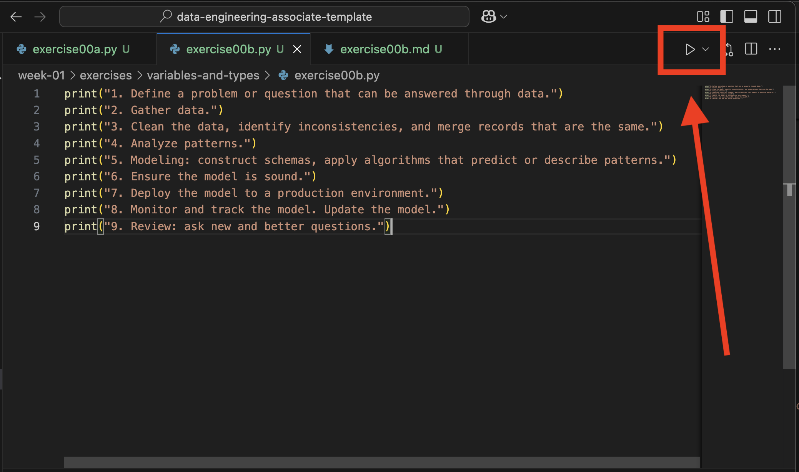

# Exercise00b

1. Add a Python script named `exercise_00b.py` to this directory.

2. Add code.

    ```py
    print("1. Define a problem or question that can be answered through data.")
    print("2. Gather data.")
    print("3. Clean the data, identify inconsistencies, and merge records that are the same.")
    print("4. Analyze patterns.")
    print("5. Modeling: construct schemas, apply algorithms that predict or describe patterns.")
    print("6. Ensure the model is sound.")
    print("7. Deploy the model to a production environment.")
    print("8. Monitor and track the model. Update the model.")
    print("9. Review: ask new and better questions.")
    ```

3. _Run Python File_ in `exercise_00b.py`.

    
