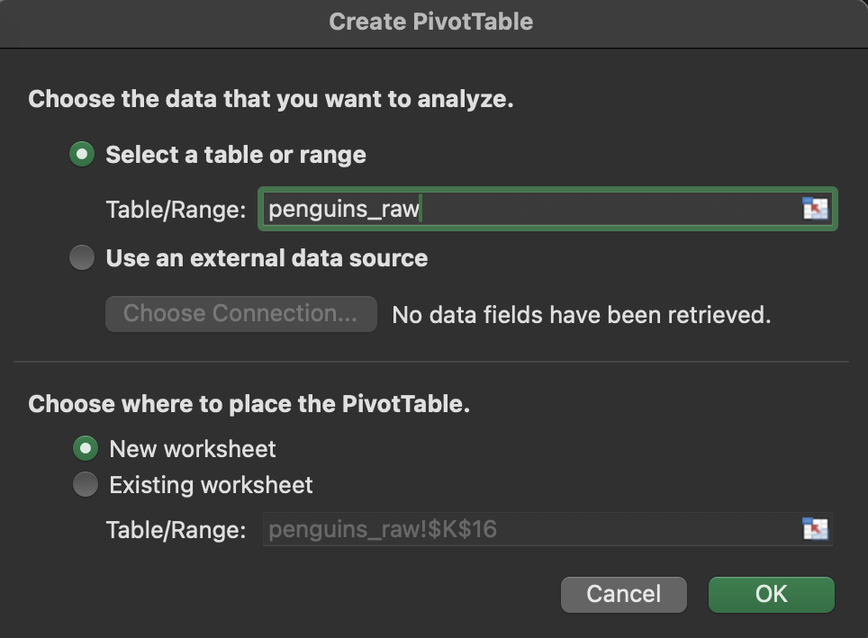

# Excel PivotTable Palmer Penguins (PPP)

1. Open `palmerpenguins.xlsx` in our `02-excel-pivottable` directory.

2. In our _Insert_ tab, click _PivotTable_.

    

3. Choose _New Worksheet_.

4. Noodle around:

    - Qualitative values are species, island, and sex.
    - Quantitative values are bill length, bill depth, flipper length, body mass, and year.
    - Map qualitative values to quantitative values.
    - Quantitative values are numeric: count, sum, average, min, max, standard deviation, variance.
    - Move qualitative values to rows.
    - Then move them to columns.
    - Add as many as you like.