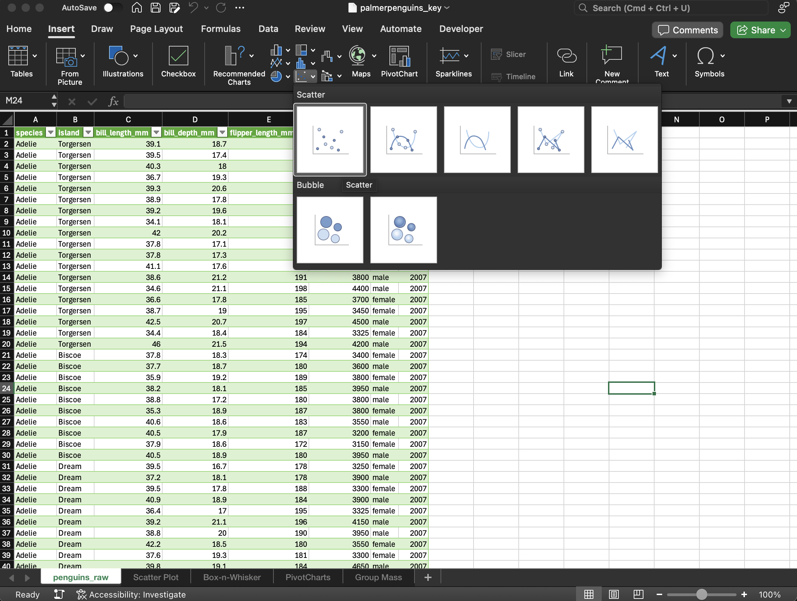

# Excel Scatter Plot

1. Open `palmerpenguins.xlsx` in our `03-excel-visualizations` directory.

2. In our _Insert_ tab, click the chart icons, specifically _Scatter_.

    

3. If we embedded it inside our `penguins_raw` worksheet, move it to another worksheet.

4. Create a Series. Our X-Axis is body mass, Column H. Our Y-Axis is bill length, Column C.

    (It can be a bit of a struggle to wrangle this data. If we use arrows keys, it won't go well. Our columns and/or rows will shift.)
    
5. Create a trendline.

6. Create a Chart Title.

7. Create an X-Axis title.

8. Click the X-Axis. Find _Axis Options_. Adjust the minimum bound and maximum bound to the appropriate level.

9. Click the Y-Axis. Find _Axis Options_. Adjust the minimum bound and maximum bound to the appropriate level.